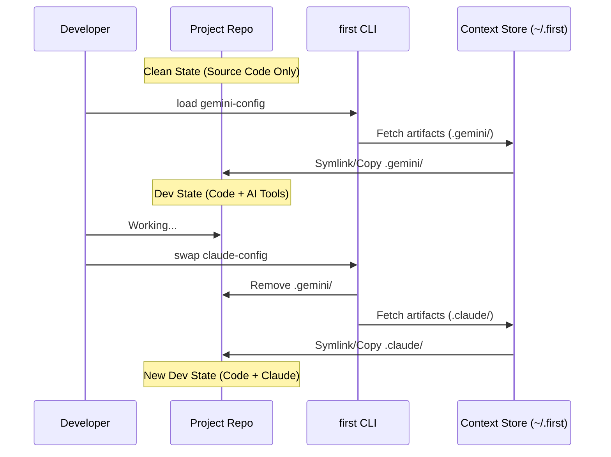

# Full Context Swapping

Full Context Swapping is the core practice enabled by `first`. It means completely replacing your development environment's configuration—your "context"—to match the task at hand.

## The Problem

Modern projects are cluttered with config files for tools that serve the _developer_, not the _code_.

- `.vscode/`
- `.idea/`
- `.gemini/`
- `.claude/`
- `.lint-config`

These files effectively "leak" the developer's personal or temporary tool choices into the permanent record of the project (git history).

## The "first" Solution

`first` allows you to externalize these configurations into **Contexts**.

### How it works

1.  **Save**: You define a context (e.g., `gemini-config`) that includes specific artifacts.
2.  **Swap**: When you load this context, `first` brings those artifacts into your workspace.
3.  **Clean**: When you're done, or swap to another context, `first` can remove the traces (feature in development) or simply lets you swap to a "clean" context.

### Benefits

- **Focus**: Your repo contains only what's needed for the build.
- **Flexibility**: Try new AI assistants or tools without committing their configs.
- **Team Standards**: Share standard contexts for onboarding or specific tasks (e.g., "Refactoring Context" with strict linter settings).
