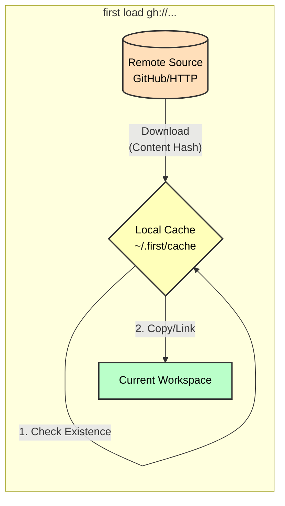

# Remote Contexts

`first` supports loading contexts directly from remote sources. This is ideal for team sharing or bootstrapping standard environments.

## Supported Sources

### GitHub Shorthand

You can use `gh://` URIs to reference files in public GitHub repositories.

```bash
first load gh://username/repo/path/to/context.fctx
```

### HTTP/HTTPS

Direct URLs to raw content are also supported.

```bash
first load https://raw.githubusercontent.com/username/repo/main/context.fctx
```

## Caching

Remote contexts and artifacts are cached locally in `~/.first/cache/`.



- `first` uses content-addressable storage for artifacts to minimize bandwidth and storage.
- Context definitions are cached but re-fetched to ensure freshness (cache policies may vary in future versions).

## Read-Only Nature

> [!IMPORTANT]
> Remote contexts are treated as **read-only**. You cannot `save` to a remote URL. This is a safety feature to prevent accidental overwrites of shared team configurations.

To modify a remote context:

1. Copy it locally or fork the repository.
2. Edit the file.
3. Push changes back to the source.
