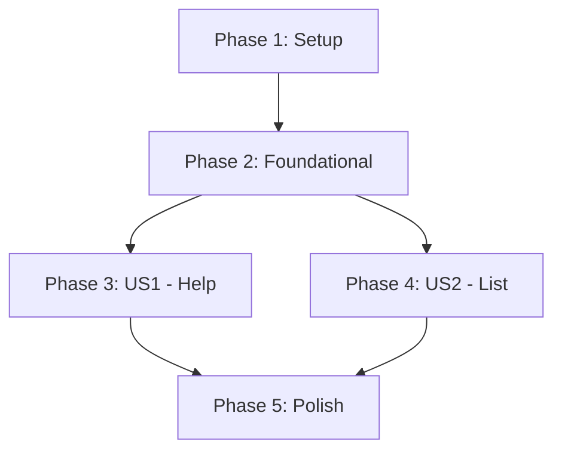

# Task List: Core CLI and Basic Actions

**Branch**: `001-core-cli-actions` | **Spec**: [spec.md](spec.md) | **Plan**: [plan.md](plan.md)

This document breaks down the implementation of the 'Core CLI and Basic Actions' feature into actionable tasks.

## Phase 1: Project Setup

*These tasks initialize the project structure and dependencies.*

- [x] T001 Create the source directory structure `src/main/scala/first/` and `tests/src/main/scala/first/`.
- [x] T002 Create a `project.scala` file in the root to define the Scala version, platform (native), and add the `decline` and `scalatest` dependencies.

## Phase 2: Foundational Code

*This phase creates the basic application entry point to ensure the build is working correctly.*

- [x] T003 Create a minimal `Main.scala` file in `src/main/scala/first/` with a `main` method that prints a "Hello, World!" message.
- [x] T004 [P] Create a corresponding `MainTests.scala` file in `tests/src/main/scala/first/` with a simple placeholder test.
- [x] T005 Compile and run the initial application to confirm the setup is correct.

## Phase 3: User Story 1 - View Help Information

*Goal: A user can view help information for the tool.*

**Independent Test**: Run `./first --help` and `./first help` and verify the output. Run `./first unknown` and verify the error message.

- [x] T006 [US1] In `src/main/scala/first/Main.scala`, define the `help` command and a default `--help` option using the `decline` library.
- [x] T007 [US1] Implement the main application logic to handle the commands and options, displaying a basic help message.
- [x] T008 [US1] Implement the error handling for when an unknown command is passed, ensuring it prints an error and suggests the `help` command.
- [x] T009 [P] [US1] In `tests/src/main/scala/first/MainTests.scala`, write a test to verify that the output of the `help` command contains the expected text.
- [x] T010 [P] [US1] In `tests/src/main/scala/first/MainTests.scala`, write a test to verify that running an unknown command produces the correct error message.

## Phase 4: User Story 2 - List Available Contexts

*Goal: A user can see a list of all available fctx definitions.*

**Independent Test**: Run `./first ls` and verify it prints a list of contexts.

- [x] T011 [US2] In `src/main/scala/first/Main.scala`, define the `ls` command using `decline`.
- [x] T012 [US2] Create a placeholder implementation for the `ls` command in `src/main/scala/first/Main.scala` that returns a hardcoded list of strings (e.g., `List("fctx1", "fctx2")`).
- [x] T013 [US2] Update the main application logic to execute the `ls` command and print its results to the console.
- [x] T014 [P] [US2] In `tests/src/main/scala/first/MainTests.scala`, write a test to verify that the `ls` command outputs the expected hardcoded list.

## Phase 5: Polish & Finalization

*Final cleanup and documentation tasks.*

- [x] T015 Review all code for style consistency and clarity.
- [x] T016 [P] Add code comments to the `decline` command definitions in `src/main/scala/first/Main.scala` explaining the structure.
- [x] T017 Update the `README.md` file with basic usage instructions for the `help` and `ls` commands.

## Dependencies

## Implementation Strategy

The suggested MVP (Minimum Viable Product) is the completion of **Phase 3**, which delivers the core `help` functionality and makes the CLI tool discoverable and usable.

### Parallel Execution

- Within each user story phase, implementation tasks (e.g., `T006`) and testing tasks (e.g., `T009`) can be worked on in parallel, as indicated by the `[P]` marker.
- User Story 1 (Phase 3) and User Story 2 (Phase 4) can be developed in parallel after Phase 2 is complete.
