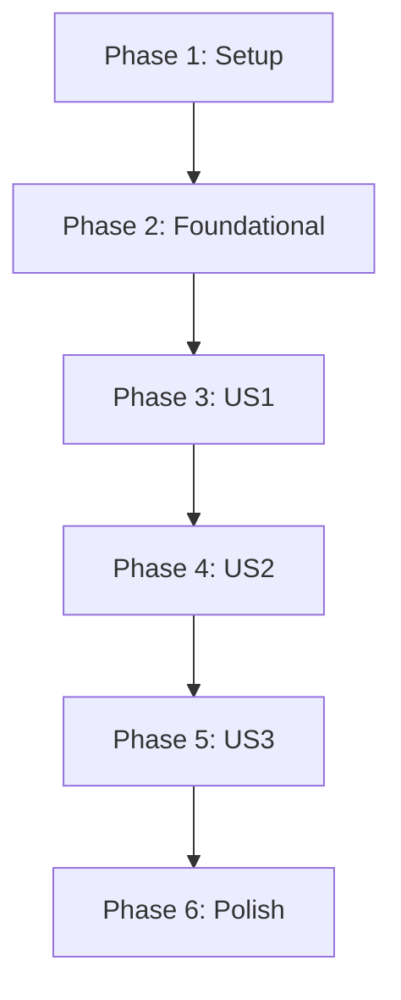

# Task List: FCTX Configuration Reading

**Branch**: `002-fctx-config-reading` | **Spec**: [spec.md](spec.md) | **Plan**: [plan.md](plan.md)

This document breaks down the implementation of the 'FCTX Configuration Reading' feature into actionable tasks.

## Phase 1: Project Setup

*These tasks initialize the project structure and dependencies for the new config module.*

- [x] T001 Add the `sconfig` library dependency (`org.ekrich::sconfig`) to the `project.scala` file.
- [x] T002 Create the directory structure `src/main/scala/first/config/` and `tests/src/main/scala/first/config/`.
- [x] T003 Create the file `src/main/scala/first/config/FctxDef.scala` and add the `FctxDef` and `Artifact` case class definitions.
- [x] T004 Create the file `src/main/scala/first/config/ConfigError.scala` and add the `ConfigError` sealed trait and its case classes.

## Phase 2: Foundational Code

*This phase creates the basic skeletons for the config reader and its tests.*

- [x] T005 Create the `ConfigReader.scala` file in `src/main/scala/first/config/` with a placeholder `ConfigReader` class.
- [x] T006 [P] Create the `ConfigReaderTests.scala` file in `tests/src/main/scala/first/config/` with a placeholder `munit` test suite.

## Phase 3: User Story 1 - Basic Configuration Loading

*Goal: Read and parse a single HOCON configuration file.*

**Independent Test**: A unit test can provide a string or mock file and assert that it is parsed into the correct `FctxDef` case class.

- [x] T007 [US1] In `ConfigReader.scala`, implement a private method that takes a file path, uses `sconfig` to parse it into a `Config` object, and returns an `Either[ConfigError, Config]`.
- [x] T008 [US1] Implement a private helper method in `ConfigReader.scala` to manually map a `Config` object to an `FctxDef` case class.
- [x] T009 [US1] Implement the main public `load` method. For this story, it will just call the single-file reading and mapping methods.
- [x] T010 [P] [US1] In `ConfigReaderTests.scala`, write a test to successfully parse a valid HOCON string and map it to an `FctxDef`.
- [x] T011 [P] [US1] In `ConfigReaderTests.scala`, write a test to verify that loading a file with invalid HOCON syntax returns a `FileParseError`.

## Phase 4: User Story 2 - Cumulative Configuration Loading

*Goal: Discover and merge multiple configuration files from the specified directory hierarchy.*

**Independent Test**: Unit tests can be written with a mock file system to verify that the discovery logic finds the correct files in the correct order.

- [x] T012 [US2] In `ConfigReader.scala`, implement a private method to scan the file system upwards from a given path, collecting all valid `fctx-def.conf` file paths in the correct order of precedence.
- [x] T013 [US2] Update the public `load` method to use the file discovery method. It should read all found `Config` objects and merge them using `withFallback` before mapping to the final `FctxDef`.
- [x] T014 [P] [US2] In `ConfigReaderTests.scala`, write a test with a mock file system to ensure that configuration values from a more specific directory override values from a less specific one.

## Phase 5: User Story 3 - Include Resolution

*Goal: Implement `includes` resolution and circular dependency detection.*

**Independent Test**: Unit tests can verify that a configuration with an `includes` correctly merges the target configuration. A separate test can confirm that a circular `includes` chain results in a `CircularDependency` error.

- [x] T015 [US3] In `ConfigReader.scala`, modify the `load` logic to recursively call itself to resolve any configurations listed in the `includes` array.
- [x] T016 [US3] Add a mechanism to the `load` method (e.g., passing a `Set` of already visited paths) to detect a circular dependency and return a `CircularDependency` error.
- [x] T017 [P] [US3] In `ConfigReaderTests.scala`, write a test for a valid `includes` and assert that the final `FctxDef` object contains merged values.
- [x] T018 [P] [US3] In `ConfigReaderTests.scala`, write a test where `a` includes `b` and `b` includes `a`, and assert that a `CircularDependency` error is returned.

## Phase 6: Polish & Integration

*Final cleanup and integration with the main CLI application.*

- [x] T019 Add a new private method to `ConfigReader.scala` to handle the resolution of relative artifact paths to absolute paths.
- [x] T020 Integrate the path resolution method into the main `load` function.
- [x] T021 [P] In `ConfigReaderTests.scala`, write a test to ensure a relative artifact path like `../foo.txt` is correctly resolved to an absolute path.
- [x] T022 Update the `ls` command in `src/main/scala/first/Main.scala` to use the new `ConfigReader` to discover and list available contexts instead of using placeholder data.

## Dependencies

## Implementation Strategy

The suggested MVP (Minimum Viable Product) is the completion of **Phase 3**, which delivers the ability to parse a single, simple configuration file. This provides the core building block for all subsequent logic.