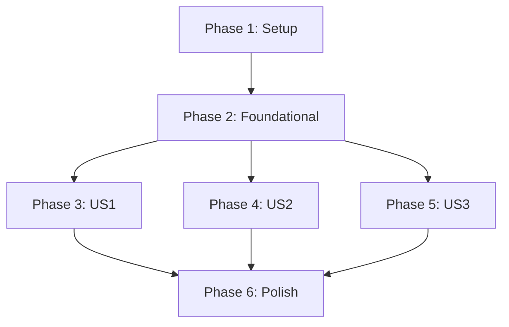

# Task List: FCTX Management Actions

**Branch**: `003-fctx-management-actions` | **Spec**: [spec.md](spec.md) | **Plan**: [plan.md](plan.md)

This document breaks down the implementation of the 'FCTX Management Actions' feature into actionable tasks.

## Phase 0: Global Options

- [X] T000 Implement the global `--at` option to specify the working directory.

## Phase 1: Project Setup

*These tasks initialize the project structure for the new fctx management commands.*

- [X] T001 Create the directory structure `src/main/scala/first/core/`, `src/main/scala/first/model/`, `src/main/scala/first/cli/`, `src/tests/scala/first/core/`, and `src/tests/scala/first/cli/`.

## Phase 2: Foundational Code

*This phase creates the basic data models and placeholder test suites.*

- [X] T002 Implement the data model `ActiveFctx` in `src/main/scala/first/model/`.
- [X] T003 [P] Create placeholder test suites for `core` and `cli` in `src/tests/scala/first/`.

## Phase 3: User Story 1 - Save a new fctx

*Goal: Implement the `save` command to create and manage fctx definitions.*

**Independent Test**: A unit test can verify that the `save` command correctly creates an `fctx-def.conf` file with the specified artifacts and handles conflicts as expected.

- [X] T004 [US1] Implement the `save` command in `src/main/scala/first/cli/SaveCommand.scala`.
- [X] T005 [US1] Implement the core logic for the `save` command in `src/main/scala/first/core/Save.scala`.
- [X] T006 [US1] Implement the interactive prompts for additive/replacement save and file conflicts.
- [X] T007 [US1] Implement the backup and restore mechanism for overwrites.
- [X] T008 [P] [US1] Write unit tests for the `save` command logic in `src/tests/scala/first/core/SaveTests.scala`.

## Phase 4: User Story 2 - Load an fctx

*Goal: Implement the `load` command to apply an fctx to the current environment.*

**Independent Test**: A unit test can verify that the `load` command correctly creates symlinks or copies files, and handles conflicts as expected.

- [X] T009 [US2] Implement the `load` command in `src/main/scala/first/cli/LoadCommand.scala`.
- [X] T010 [US2] Implement the core logic for the `load` command in `src/main/scala/first/core/Load.scala`.
- [X] T011 [US2] Implement checksum matching for artifacts.
- [X] T012 [US2] Implement the interactive prompts for file conflicts.
- [X] T013 [US2] Implement the backup and restore mechanism for overwrites.
- [X] T014 [P] [US2] Write unit tests for the `load` command logic in `src/tests/scala/first/core/LoadTests.scala`.

## Phase 5: User Story 3 - Swap between two fctxs

*Goal: Implement the `swap` command to efficiently transition between two fctxs.*

**Independent Test**: A unit test can verify that the `swap` command correctly adds, removes, and skips artifacts when transitioning between two contexts.

- [X] T015 [US3] Implement the `swap` command in `src/main/scala/first/cli/SwapCommand.scala`.
- [X] T016 [US3] Implement the core logic for the `swap` command in `src/main/scala/first/core/Swap.scala`.
- [X] T017 [US3] Implement the logic for diffing two fctxs.
- [X] T018 [P] [US3] Write unit tests for the `swap` command logic in `src/tests/scala/first/core/SwapTests.scala`.

## Phase 6: Polish & Integration

*Final cleanup and integration with the main CLI application.*

- [X] T019 Integrate the `save`, `load`, and `swap` commands into the main CLI application in `src/main/scala/first/Main.scala`.
- [X] T020 Implement the tracking of the currently loaded fctx in `src/main/scala/first/core/`.
- [X] T021 [P] Write integration tests for the CLI commands in `src/tests/scala/first/cli/`.

## Dependencies

## Implementation Strategy

The suggested MVP (Minimum Viable Product) is the completion of **Phase 3**, which delivers the ability to save a new fctx. This provides the core building block for all subsequent logic.
